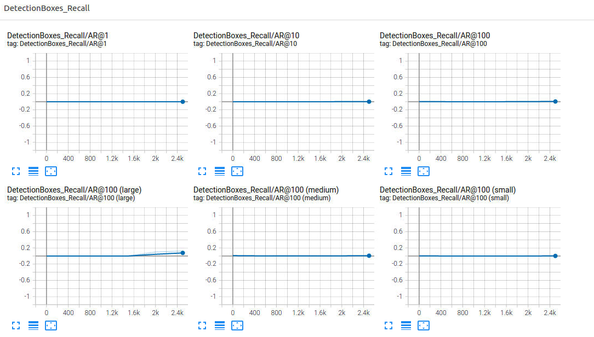
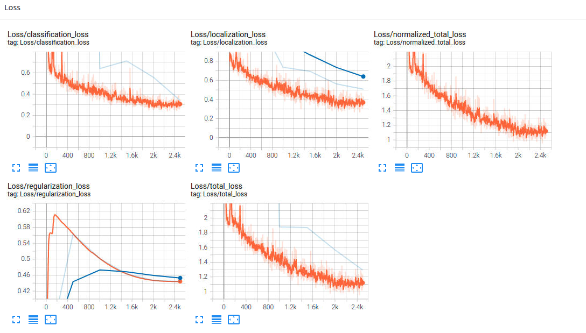
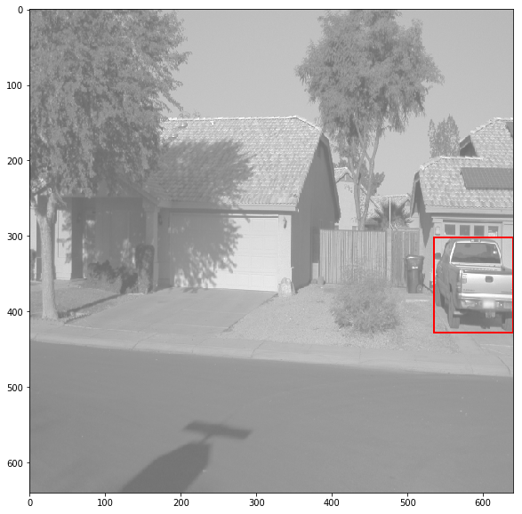
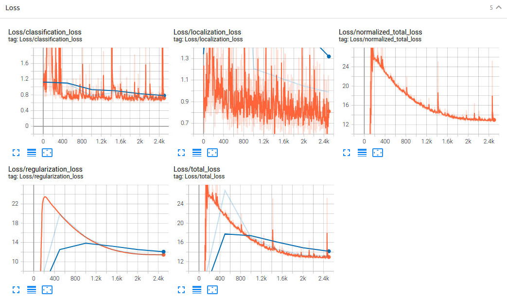
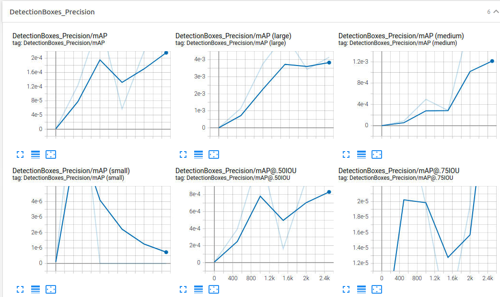
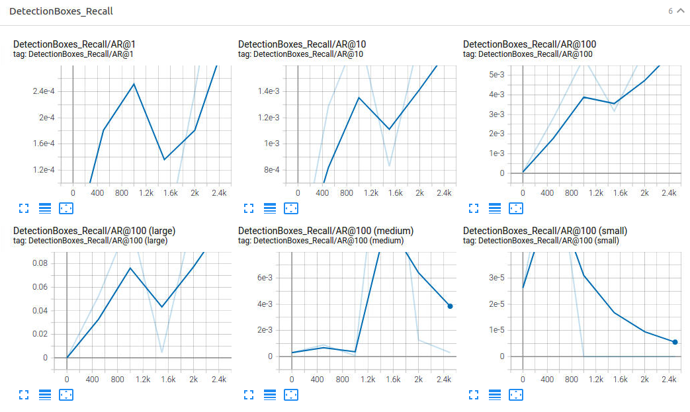

# Object Detection in an Urban Environment

## Data

For this project, we will be using data from the [Waymo Open dataset](https://waymo.com/open/).

[OPTIONAL] - The files can be downloaded directly from the website as tar files or from the [Google Cloud Bucket](https://console.cloud.google.com/storage/browser/waymo_open_dataset_v_1_2_0_individual_files/) as individual tf records. We have already provided the data required to finish this project in the workspace, so you don't need to download it separately.

## Structure

### Data

The data you will use for training, validation and testing is organized as follow:
```
/home/workspace/data/waymo
    - training_and_validation - contains 97 files to train and validate your models
    - train: contain the train data (empty to start)
    - val: contain the val data (empty to start)
    - test - contains 3 files to test your model and create inference videos
```

The `training_and_validation` folder contains file that have been downsampled: we have selected one every 10 frames from 10 fps videos. The `testing` folder contains frames from the 10 fps video without downsampling.

You will split this `training_and_validation` data into `train`, and `val` sets by completing and executing the `create_splits.py` file.

### Experiments
The experiments folder will be organized as follow:
```
experiments/
    - pretrained_model/
    - exporter_main_v2.py - to create an inference model
    - model_main_tf2.py - to launch training
    - reference/ - reference training with the unchanged config file
    - experiment0/ - create a new folder for each experiment you run
    - experiment1/ - create a new folder for each experiment you run
    - experiment2/ - create a new folder for each experiment you run
    - label_map.pbtxt
    ...
```

## Prerequisites

### Local Setup

For local setup if you have your own Nvidia GPU, you can use the provided Dockerfile and requirements in the [build directory](./build).

Follow [the README therein](./build/README.md) to create a docker container and install all prerequisites.

### Download and process the data

**Note:** ”If you are using the classroom workspace, we have already completed the steps in the section for you. You can find the downloaded and processed files within the `/home/workspace/data/preprocessed_data/` directory. Check this out then proceed to the **Exploratory Data Analysis** part.

The first goal of this project is to download the data from the Waymo's Google Cloud bucket to your local machine. For this project, we only need a subset of the data provided (for example, we do not need to use the Lidar data). Therefore, we are going to download and trim immediately each file. In `download_process.py`, you can view the `create_tf_example` function, which will perform this processing. This function takes the components of a Waymo Tf record and saves them in the Tf Object Detection api format. An example of such function is described [here](https://tensorflow-object-detection-api-tutorial.readthedocs.io/en/latest/training.html#create-tensorflow-records). We are already providing the `label_map.pbtxt` file.

You can run the script using the following command:
```
python download_process.py --data_dir {processed_file_location} --size {number of files you want to download}
```

You are downloading 100 files (unless you changed the `size` parameter) so be patient! Once the script is done, you can look inside your `data_dir` folder to see if the files have been downloaded and processed correctly.

### Classroom Workspace

In the classroom workspace, every library and package should already be installed in your environment. You will NOT need to make use of `gcloud` to download the images.

## Instructions

### Exploratory Data Analysis

You should use the data already present in `/home/workspace/data/waymo` directory to explore the dataset! This is the most important task of any machine learning project. To do so, open the `Exploratory Data Analysis` notebook. In this notebook, your first task will be to implement a `display_instances` function to display images and annotations using `matplotlib`. This should be very similar to the function you created during the course. Once you are done, feel free to spend more time exploring the data and report your findings. Report anything relevant about the dataset in the writeup.

Keep in mind that you should refer to this analysis to create the different spits (training, testing and validation).


### Create the training - validation splits
In the class, we talked about cross-validation and the importance of creating meaningful training and validation splits. For this project, you will have to create your own training and validation sets using the files located in `/home/workspace/data/waymo`. The `split` function in the `create_splits.py` file does the following:
* create three subfolders: `/home/workspace/data/train/`, `/home/workspace/data/val/`, and `/home/workspace/data/test/`
* split the tf records files between these three folders by symbolically linking the files from `/home/workspace/data/waymo/` to `/home/workspace/data/train/`, `/home/workspace/data/val/`, and `/home/workspace/data/test/`

Use the following command to run the script once your function is implemented:
```
python create_splits.py --data-dir /home/workspace/data
```

### Edit the config file

Now you are ready for training. As we explain during the course, the Tf Object Detection API relies on **config files**. The config that we will use for this project is `pipeline.config`, which is the config for a SSD Resnet 50 640x640 model. You can learn more about the Single Shot Detector [here](https://arxiv.org/pdf/1512.02325.pdf).

First, let's download the [pretrained model](http://download.tensorflow.org/models/object_detection/tf2/20200711/ssd_resnet50_v1_fpn_640x640_coco17_tpu-8.tar.gz) and move it to `/home/workspace/experiments/pretrained_model/`.

We need to edit the config files to change the location of the training and validation files, as well as the location of the label_map file, pretrained weights. We also need to adjust the batch size. To do so, run the following:
```
python edit_config.py --train_dir /home/workspace/data/train/ --eval_dir /home/workspace/data/val/ --batch_size 2 --checkpoint /home/workspace/experiments/pretrained_model/ssd_resnet50_v1_fpn_640x640_coco17_tpu-8/checkpoint/ckpt-0 --label_map /home/workspace/experiments/label_map.pbtxt
```
A new config file has been created, `pipeline_new.config`.

### Training

You will now launch your very first experiment with the Tensorflow object detection API. Move the `pipeline_new.config` to the `/home/workspace/experiments/reference` folder. Now launch the training process:
* a training process:
```
python experiments/model_main_tf2.py --model_dir=experiments/reference/ --pipeline_config_path=experiments/reference/pipeline_new.config
```
Once the training is finished, launch the evaluation process:
* an evaluation process:
```
python experiments/model_main_tf2.py --model_dir=experiments/reference/ --pipeline_config_path=experiments/reference/pipeline_new.config --checkpoint_dir=experiments/reference/
```

**Note**: Both processes will display some Tensorflow warnings, which can be ignored. You may have to kill the evaluation script manually using
`CTRL+C`.

To monitor the training, you can launch a tensorboard instance by running `python -m tensorboard.main --logdir experiments/reference/`. You will report your findings in the writeup.

### Improve the performances

Most likely, this initial experiment did not yield optimal results. However, you can make multiple changes to the config file to improve this model. One obvious change consists in improving the data augmentation strategy. The [`preprocessor.proto`](https://github.com/tensorflow/models/blob/master/research/object_detection/protos/preprocessor.proto) file contains the different data augmentation method available in the Tf Object Detection API. To help you visualize these augmentations, we are providing a notebook: `Explore augmentations.ipynb`. Using this notebook, try different data augmentation combinations and select the one you think is optimal for our dataset. Justify your choices in the writeup.

Keep in mind that the following are also available:
* experiment with the optimizer: type of optimizer, learning rate, scheduler etc
* experiment with the architecture. The Tf Object Detection API [model zoo](https://github.com/tensorflow/models/blob/master/research/object_detection/g3doc/tf2_detection_zoo.md) offers many architectures. Keep in mind that the `pipeline.config` file is unique for each architecture and you will have to edit it.

**Important:** If you are working on the workspace, your storage is limited. You may to delete the checkpoints files after each experiment. You should however keep the `tf.events` files located in the `train` and `eval` folder of your experiments. You can also keep the `saved_model` folder to create your videos.


### Creating an animation
#### Export the trained model
Modify the arguments of the following function to adjust it to your models:

```
python experiments/exporter_main_v2.py --input_type image_tensor --pipeline_config_path experiments/reference/pipeline_new.config --trained_checkpoint_dir experiments/reference/ --output_directory experiments/reference/exported/
```

This should create a new folder `experiments/reference/exported/saved_model`. You can read more about the Tensorflow SavedModel format [here](https://www.tensorflow.org/guide/saved_model).

Finally, you can create a video of your model's inferences for any tf record file. To do so, run the following command (modify it to your files):
```
python inference_video.py --labelmap_path label_map.pbtxt --model_path experiments/reference/exported/saved_model --tf_record_path /data/waymo/testing/segment-12200383401366682847_2552_140_2572_140_with_camera_labels.tfrecord --config_path experiments/reference/pipeline_new.config --output_path animation.gif
```

## Submission Template

### Project overview
This project is about UDACTY self-driving car nano degree computer vision project.
Retraining the pretrained model (`ssd_resnet50_v1_fpn_640x640_coco17`) with `Waymo dataset` by `TensorFlow Object Detection API`.
You can easily retrain model by just following this instructions. Addtionally, data analysis was performed in this project.
And analysis between reference experiment and new method for improving model was performed.

Object detection is one of the most important component in self driving car sytstem, because car should avoid collision when driving.
Detecting vehicles, pedestrians, signs, etc is very important issue in building self driving system.


### Set up
If you want to set up this project in local computer with your own GPU, please use the Dockerfile to create the docker image from `build` folder.

You can create docker image by following command. 

```
$ source ./build.sh
```

Then, run the image to create container.

```
$ source ./run.sh
```


### Dataset
You should downlaod the `waymo` open dataset by Google Cloud before training the model.
Please login google cloud with your account.

```
$ gcloud auth login
```

You can download the dataset with command.
```
$ python download_process.py
```

You should make the dataset folder, and split into (1) test (2) train (3) val folders.
```
$ mkdir data/test data/train data/val
$ python create_splits.py --source data/processed --destination data
```


#### Dataset analysis

Analysis for the downloaded dataset also can be performed. 
Below shows the distribution of classes number (vehicle, pedestrian, cyclist) and mean pixel value distribution of dataset.
You can get these results by running `Exploratory_Data_Analysis.ipynb`.


#### Cross validation
The downloaded dataset is shuffled and split into `training`, `testing`, and `validation`.
`75%` for training, `15%` for validation, and `10%` for testing to check the error rate in this project.


### Training
#### Reference experiment
Reference experiment without augmentation was performed, and `experiments/reference/pipeline_new.config` shows the detailed parameters for training.
There are results below. 

`Reference experiment - Loss : `


`Reference experiment - Precision : `


`Reference experiment - Recall : `



You can check the `classification loss` is upper than 20 at first and converges to zero later.
And `localization loss` is showed extremely noisy in this result. 
Now let's check metrices. 
In DetectionBoxes_Recall/AR@100, `Recall` little bit changed in training step 2.4k later.
But most of `Precision` and `Recall` are extremely low, so it is hard to use in object detection.


#### Improve on the reference
***[#1] Increase Batch Size***
- Because ResNet is large scale convolution neural network, increasing the batch size would be helpful.
- The batch size is changed from `2` to `8`.
- The detailed pipeline is in `experiments/improved/pipeline_new.config`.
- There are results below.

`Improved experiment1 - Loss : `



`Improved experiment1 - Precision : `


`Improved experiment1 - Recall : `


We see significant improvement in model loss, and Precision-Recall rate. This is a indication of better performance. 
A video based on the model inferences for `data/test/segment-12200383401366682847_2552_140_2572_140_with_camera_labels.tfrecord`. We can see the model is now able to detect and classify objects nearby, but not the smaller objects far away.


***[#2] Train with Augmentation***
- 0.2 probability of grayscale conversion: this could better simulate rainy or foggy weather conditions, or area under huge shadow

- contrast value from 0.5 to 1.0: this added more variation to edge detectability

- brightness adjusted to 0.3: this could better simulate very sunny day with very bright light

More details of the agumentation can be found in `Explore augmentations.ipynb`, and the detailed pipeline is in `experiments/experiment2/pipeline_new.config`. However, due to limitation of memory in the VM workspace, we have to resort to batch size of `2`, and step size of `2500`, which is very likely not enough for the network to converge. As a result, the performance does improve a lot, compared with reference model.

`Improved experiment2 - Loss : `



`Improved experiment2 - Precison : `



`Improved experiment2 - Recall : `



Althought we see a decrease in model loss, increase in precision and recall is tiny. The inference result is almost the same as that of the reference model, which barely detect anything. Thus, there is no pointing showing the inference video here.  

By investigating the model on the test dataset, we can see the model is not goot at detecting small objects in the images. As cyclists only appear very scarcely in the datasets, we can expect the model to struggle to detect cyclists. In the future, improvements can be made in using higher resolution data for training, and sampling with more images with cyclist. More importantly, we want train for more steps with lower learning rate so that the model converges, provided that computers have larger computational resources and memories.